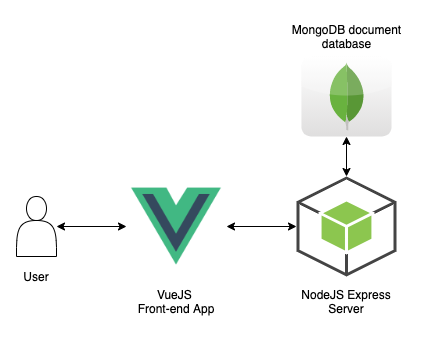

# PDS
Repositório para o trabalho de Prática em Desenvolvimento de Software.

## Projeto

O **Puncto** é uma aplicação de apontamento de horas voltada para profissionais autônomos. Além de fazer o controle de horas, permite também geração de invoices.

Features:
- Autenticacao
- Cadastro de dados pesoais
- Lancamento de horas
- Cadastro de clientes
- Geracao automatizada de invoices

## Equipe

Pretendemos organizar o trabalho de forma que todos os membros participem pelo menos um pouco de todas as partes do desenvolvimento e consigam ter experiencia de trabalhar com tudo. Porém achamos que seria interessante definir responsáveis por cada área também, para facilitar a gestão.

- Bruna Melo (Front-end)

- Philipe Atela (Back-end/Devops)

- Gabriel Chaves (Back-end/Devops)

- Lívia Almeida (UI/UX, Front-end, DBA)

## Stack

- **Cross**

  - [TypeScript](https://www.typescriptlang.org/)

  - [ESLint](https://eslint.org/)

  - [Jest](https://jestjs.io/)

  - [New Relic](https://newrelic.com/)

- **Front**

  - [Vue.js](https://vuejs.org/)

  - [SCSS](https://sass-lang.com/)

  - [Figma](https://www.figma.com/)

  - Analytics (A definir)

  - Teste de interface (A definir)

- **Back**

  - [Express](https://expressjs.com/)

  - [MongoDB](https://www.mongodb.com/1)

  - [SuperTest](https://github.com/visionmedia/supertest)

- **DevOps**

  - [Firebase](https://firebase.google.com/)
  - [Github Actions](https://github.com/features/actions)

## Arquitetura

## User Stories
 - **Autenticacao**: Como usuario, sou capaz de criar uma conta, fazer log in e salvar meus dados, lancamentos de hora e clientes.
 - **Cadastro de dados pessoais:** Como usuario, consigo cadastrar os meus dados na plataforma, de forma que não preciso manualmente preenche-los para gerar os invoices todo mes.
 - **Cadastro de clientes:** Como usuario, consigo cadastrar os dados do meu cliente na plataforma, para nao precisar preencher todo mes ao gerar os invoices
 - **Lancamento de horas:** Como usuario, consigo especificar quantas horas trabalhei no dia e salvar essa informacao. Consigo tambem visualizar isso de forma consolidada facilmente.
 - **Geracao automatizada de invoices:** Como usuario, consigo facilmente juntar as informacoes de lancamento de hora do mes, com as de um cliente cadastrado e os meus proprios dados, e gerar um invoice automatico.

## SPRINT 1
  Lista de historias de usuario e suas tasks para o escopo dessa sprint:

  - Inception
    * Fazer setup backend [Gabriel]
    * Fazer setup frontend [Livia]
    * Fazer prototipo visual [Livia]
    * Fazer diagrama da arquitetura do projeto [Philipe]
    * Middleware de validacao na API [Philipe]
  - Autenticacao
    * Criar api de login e cadastro [Philipe]
    * Middleware de autenticacao na API [Philipe]
    * Criar tela de login [Bruna]
    * Criar tela de cadastro []
  - Cadastro de dados pessoais
    * Criar api de cadastro de dados pessoais [Gabriel]
    * Criar tela de cadastro de dados pessoais [Bruna]

## SPRINT 2
  - Criar api de cadastro de clientes
  - Criar tela de cadastro de clientes
  - Criar api de gerenciamento de ponto
  - Criar tela de gerenciamento de ponto

## SPRINT 3
  - Criar api de invoices
  - Criar tela de invoices
  - Criar tela de ajuda
  - Criar tela de estatistica

